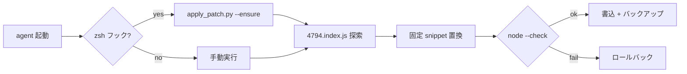

<p align="center">
  <a href="README.md">English</a> ·
  <a href="README.ko.md">한국어</a> ·
  <a href="README.ja.md"><strong>日本語</strong></a> ·
  <a href="README.zh-CN.md">简体中文</a> ·
  <a href="README.zh-TW.md">繁體中文</a>
</p>

<p align="center">
  
</p>

<h1 align="center">cursor-agent-cjk-input-patch</h1>

<p align="center">
  <strong>Cursor Agent CLI 向け CJK 入力パッチ</strong><br>
  <sub>Option/Ctrl 単語移動 · 空行ナビ · ローカル · 可逆 · 非公式</sub>
</p>

<p align="center">
  <a href="LICENSE"></a>
  
  
  
</p>

<br>

<table>
<tr>
<td width="50%" valign="top">

### パッチ前

`agent` で **한글 · 日本語 · 中文** を入力すると:

- **Option/Alt + ← / →** が CJK を飛ばし ASCII 単語へジャンプ
- 折り返し URL 上の **空行で ↑** するとスクロールが飛び URL 行へ

</td>
<td width="50%" valign="top">

### パッチ後

同じキー、自然な動き:

- 単語移動が CJK 単語で停止 (`Intl.Segmenter`)
- 空行が正しい視覚行にマップ — スクロールジャンプなし

</td>
</tr>
</table>

<p align="center">
  
</p>

<br>

## クイックスタート

```bash
git clone https://github.com/vzts/cursor-agent-cjk-input-patch.git
cd cursor-agent-cjk-input-patch

python3 tests/test_behavior.py   # 検証 — Cursor インストール不要
python3 apply_patch.py           # 最新 CLI + IDE worker をパッチ
python3 apply_patch.py --install # 任意: `agent` 起動ごとに自動パッチ
```

パッチ後 `agent` / `cursor-agent` セッションを再起動。

<details>
<summary><strong>必要環境</strong></summary>

<br>

- **Python 3** — パッチャー実行
- **Node.js** — 書き込み前 `node --check`
- **macOS** — Cursor Agent CLI パス前提
- **Cursor Agent CLI** — ローカルインストール済み（本 repo はバイナリ同梱なし）

</details>

<br>

## パッチ対象

既存インストールの **`4794.index.js`**（テキスト入力バンドル）のみ。

| | |
|:--|:--|
| **単語移動** | ASCII helper → `Intl.Segmenter` (`granularity: "word"`), Option/Ctrl + 矢印 |
| **空行** | `findLine` 修正 — 空行・折り返し EOL が line 0 に落ちない |

自動対象:

```
~/.local/share/cursor-agent/versions/<最新>/
~/Library/Application Support/Cursor/.../cursor-agent-worker/.../versions/<最新>/
```

<br>

## 意図的にパッチしない

| 領域 | 理由 |
|:-----|:-----|
| 通常 **← / →** | NFC ハングルは UTF-16 で 1 音節 |
| **Backspace / Delete** grapheme | 同上 — 不要 |
| CJK **表示幅 ↑ / ↓** | ターミナル 1 列/コードポイント、幅 2 は誤着地 |
| **IME** 候補 | 旧再配置で `agent` ハング — 削除・拒否 |

エスケープシーケンスでターミナルカーソルは動かしません。

<br>

## コマンド

```bash
python3 apply_patch.py              # パッチ
python3 apply_patch.py --install    # zsh フック → 起動時自動
python3 apply_patch.py --ensure     # 済みなら静かに; 不一致は警告
python3 apply_patch.py --restore    # .orig.bak から復元
python3 apply_patch.py --list-backups
python3 apply_patch.py --dry-run -v
python3 apply_patch.py --no-worker  # CLI のみ
```

<details>
<summary><strong>CLI 更新 · バックアップ · 再インストール</strong></summary>

<br>

更新でバージョンフォルダが置き換わります。`python3 apply_patch.py` を再実行（`--install` なら `agent` 起動のみでも可）。

バックアップ — バージョンごとに原典 1 つ、上書きなし:

```
~/.local/share/cursor-agent-cjk-input-patch/backups/*.orig.bak
```

ミニファイ不一致時 **推測せず失敗**（`--ensure` は警告後 `agent` 起動）。最終手段:

```bash
curl https://cursor.com/install -fsS | bash
```

</details>

<br>

## 動作フロー



パターンは特定 minify 形状に固定 — Cursor が再 minify したら推測しません。

<br>

## テスト

```bash
python3 tests/test_behavior.py
python3 tests/test_pty_arrows.py
```

<br>

<p align="center">
  <sub>非公式 · Cursor とは無関係 · <a href="LICENSE">MIT</a> © 2026 <a href="https://github.com/vzts">vzts</a></sub>
</p>
