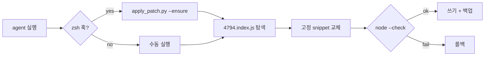

<p align="center">
  <a href="README.md">English</a> ·
  <a href="README.ko.md"><strong>한국어</strong></a> ·
  <a href="README.ja.md">日本語</a> ·
  <a href="README.zh-CN.md">简体中文</a> ·
  <a href="README.zh-TW.md">繁體中文</a>
</p>

<p align="center">
  
</p>

<h1 align="center">cursor-agent-cjk-input-patch</h1>

<p align="center">
  <strong>Cursor Agent CLI CJK 입력 패치</strong><br>
  <sub>Option/Ctrl 단어 이동 · 빈 줄 탐색 · 로컬 · 되돌리기 가능 · 비공식</sub>
</p>

<p align="center">
  <a href="LICENSE"></a>
  
  
  
</p>

<br>

<table>
<tr>
<td width="50%" valign="top">

### 패치 전

`agent`에서 **한글 · 日本語 · 中文** 입력 시:

- **Option/Alt + ← / →** 가 CJK를 건너뛰고 ASCII 단어로 점프
- 긴 URL 위 **빈 줄에서 ↑** 하면 스크롤이 튀고 URL 줄로 커서 이동

</td>
<td width="50%" valign="top">

### 패치 후

같은 키, 자연스러운 동작:

- 단어 이동이 CJK 단어 단위로 멈춤 (`Intl.Segmenter`)
- 빈 줄이 올바른 시각적 줄에 매핑 — 스크롤 점프 없음

</td>
</tr>
</table>

<p align="center">
  
</p>

<br>

## 빠른 시작

```bash
git clone https://github.com/vzts/cursor-agent-cjk-input-patch.git
cd cursor-agent-cjk-input-patch

python3 tests/test_behavior.py   # 검증 — Cursor 설치 불필요
python3 apply_patch.py           # 최신 CLI + IDE worker 패치
python3 apply_patch.py --install # 선택: `agent` 실행마다 자동 패치
```

패치 후 `agent` / `cursor-agent` 세션을 재시작하세요.

<details>
<summary><strong>필요 환경</strong></summary>

<br>

- **Python 3** — 패처 실행
- **Node.js** — 쓰기 전 `node --check`
- **macOS** — Cursor Agent CLI 경로 기준
- **Cursor Agent CLI** — 로컬 설치 필요 (본 repo는 바이너리 미포함)

</details>

<br>

## 패치 대상

기존 설치의 **`4794.index.js`** (텍스트 입력 번들)만 수정합니다.

| | |
|:--|:--|
| **단어 이동** | ASCII helper → `Intl.Segmenter` (`granularity: "word"`), Option/Ctrl + 화살표 |
| **빈 줄** | `findLine` 수정 — 빈 줄·줄바꿈 EOL이 line 0으로 떨어지지 않음 |

자동 대상:

```
~/.local/share/cursor-agent/versions/<최신>/
~/Library/Application Support/Cursor/.../cursor-agent-worker/.../versions/<최신>/
```

<br>

## 의도적으로 패치하지 않음

| 영역 | 이유 |
|:-----|:-----|
| 일반 **← / →** | NFC 한글은 UTF-16에서 이미 음절 단위 |
| **Backspace / Delete** grapheme | 동일 — 패치 불필요 |
| CJK **표시 폭 ↑ / ↓** | 터미널 커서 1칸/코드포인트, 폭 2 계산 오류 |
| **IME** 후보창 | 예전 재배치 패치가 `agent` 멈춤 — 제거·거부 |

터미널 커서를 escape sequence로 움직이지 않습니다.

<br>

## 명령어

```bash
python3 apply_patch.py              # 패치
python3 apply_patch.py --install    # zsh 훅 → 실행 시 자동 패치
python3 apply_patch.py --ensure     # 완료 시 조용히 종료; 불일치 시 경고
python3 apply_patch.py --restore    # .orig.bak 에서 복원
python3 apply_patch.py --list-backups
python3 apply_patch.py --dry-run -v
python3 apply_patch.py --no-worker  # CLI만
```

<details>
<summary><strong>CLI 업데이트 · 백업 · 재설치</strong></summary>

<br>

업데이트 시 버전 폴더가 교체됩니다. `python3 apply_patch.py` 재실행 (`--install` 설정 시 `agent`만 실행해도 됨).

백업 — 버전당 원본 하나, 덮어쓰지 않음:

```
~/.local/share/cursor-agent-cjk-input-patch/backups/*.orig.bak
```

미니파이 패턴 불일치 시 **추측하지 않고 실패** (`--ensure`는 경고 후 `agent` 실행). 최후 수단:

```bash
curl https://cursor.com/install -fsS | bash
```

</details>

<br>

## 동작 흐름



패턴은 특정 minify 형태에 고정 — Cursor가 다시 minify하면 추측하지 않습니다.

<br>

## 테스트

```bash
python3 tests/test_behavior.py
python3 tests/test_pty_arrows.py   # 패치된 CLI 필요
```

<br>

<p align="center">
  <sub>비공식 커뮤니티 도구 · Cursor와 무관 · <a href="LICENSE">MIT</a> © 2026 <a href="https://github.com/vzts">vzts</a></sub>
</p>
