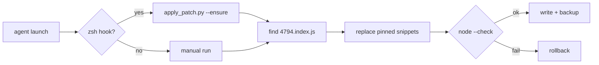

<p align="center">
  <a href="README.md"><strong>English</strong></a> ·
  <a href="README.ko.md">한국어</a> ·
  <a href="README.ja.md">日本語</a> ·
  <a href="README.zh-CN.md">简体中文</a> ·
  <a href="README.zh-TW.md">繁體中文</a>
</p>

<p align="center">
  
</p>

<h1 align="center">cursor-agent-cjk-input-patch</h1>

<p align="center">
  <strong>CJK-friendly input for Cursor Agent CLI</strong><br>
  <sub>Option/Ctrl word jump · blank-line navigation · local · reversible · unofficial</sub>
</p>

<p align="center">
  <a href="LICENSE"></a>
  
  
  
</p>

<br>

<table>
<tr>
<td width="50%" valign="top">

### Before

Typing **한글 · 日本語 · 中文** in `agent` feels off:

- **Option/Alt + ← / →** skips CJK and jumps to the previous ASCII word
- **↑** onto a blank line above a wrapped URL scrolls away and snaps the caret to the URL

</td>
<td width="50%" valign="top">

### After

Same keys, natural behavior:

- Word jump stops on each CJK word (`Intl.Segmenter`)
- Blank lines map to the correct visual row — no scroll jump

</td>
</tr>
</table>

<p align="center">
  
</p>

<br>

## Quick start

```bash
git clone https://github.com/vzts/cursor-agent-cjk-input-patch.git
cd cursor-agent-cjk-input-patch

python3 tests/test_behavior.py   # sanity check — no Cursor install needed
python3 apply_patch.py           # patch latest CLI + IDE worker
python3 apply_patch.py --install # optional: auto-patch on every `agent` launch
```

Restart `agent` / `cursor-agent` after patching.

<details>
<summary><strong>Requirements</strong></summary>

<br>

- **Python 3** — runs the patcher
- **Node.js** — `node --check` before writing
- **macOS** — paths match Cursor Agent CLI layout
- **Cursor Agent CLI** — already installed locally (this repo does not ship it)

</details>

<br>

## What it patches

Patches only **`4794.index.js`** — the text-input bundle in your existing install.

| | |
|:--|:--|
| **Word motion** | ASCII-only helpers → `Intl.Segmenter` (`granularity: "word"`) for Option/Ctrl + arrow |
| **Empty lines** | `findLine` fix so blank rows and wrap EOL don't fall back to line 0 |

Auto-targets:

```
~/.local/share/cursor-agent/versions/<latest>/
~/Library/Application Support/Cursor/.../cursor-agent-worker/.../versions/<latest>/
```

<br>

## What it deliberately skips

| Area | Reason |
|:-----|:-------|
| Plain **← / →** | NFC Hangul is already one UTF-16 step per syllable |
| **Backspace / Delete** grapheme | Same — no patch needed |
| CJK **display-width ↑ / ↓** | Terminal caret is 1 column per code point; width-2 math lands wrong |
| **IME** candidate position | Old reposition patch hung `agent` — removed and refused |

The patcher never moves the terminal cursor with escape sequences.

<br>

## Commands

```bash
python3 apply_patch.py              # patch
python3 apply_patch.py --install    # zsh hook → auto-patch on launch
python3 apply_patch.py --ensure     # quiet skip if done; warn on mismatch
python3 apply_patch.py --restore    # rollback from .orig.bak
python3 apply_patch.py --list-backups
python3 apply_patch.py --dry-run -v
python3 apply_patch.py --no-worker  # CLI only
```

<details>
<summary><strong>After a CLI update · backups · reinstall</strong></summary>

<br>

Cursor updates replace the version folder. Re-run `python3 apply_patch.py` (or just launch `agent` if `--install` is set).

Backups — one pristine original per version, never overwritten:

```
~/.local/share/cursor-agent-cjk-input-patch/backups/*.orig.bak
```

If a future minify no longer matches, the patcher **fails closed** (`--ensure` warns and still starts `agent`). Last resort:

```bash
curl https://cursor.com/install -fsS | bash
```

</details>

<br>

## How it works



Patterns are pinned to a specific minified shape — the patcher refuses to guess if Cursor re-minifies differently.

<br>

## Tests

```bash
python3 tests/test_behavior.py    # portable, no Cursor needed
python3 tests/test_pty_arrows.py  # PTY checks (needs patched CLI)
```

<br>

<p align="center">
  <sub>Unofficial community tool · not affiliated with Cursor · <a href="LICENSE">MIT</a> © 2026 <a href="https://github.com/vzts">vzts</a></sub>
</p>
