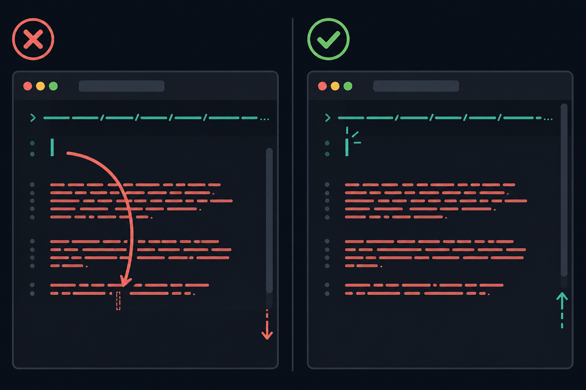
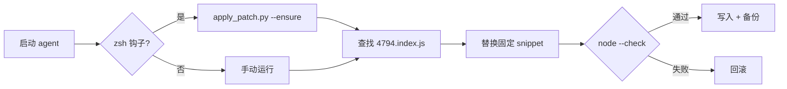

<p align="center">
  <a href="README.md">English</a> ·
  <a href="README.ko.md">한국어</a> ·
  <a href="README.ja.md">日本語</a> ·
  <a href="README.zh-CN.md"><strong>简体中文</strong></a> ·
  <a href="README.zh-TW.md">繁體中文</a>
</p>

<p align="center">
  
</p>

<h1 align="center">cursor-agent-cjk-input-patch</h1>

<p align="center">
  <strong>Cursor Agent CLI CJK 输入补丁</strong><br>
  <sub>Option/Ctrl 按词移动 · 空行导航 · 本地 · 可撤销 · 非官方</sub>
</p>

<p align="center">
  <a href="LICENSE"></a>
  
  
  
</p>

<br>

<table>
<tr>
<td width="50%" valign="top">

### 补丁前

在 `agent` 中输入 **한글 · 日本語 · 中文** 时:

- **Option/Alt + ← / →** 跳过 CJK，跳到上一个 ASCII 词
- 在换行 URL 上方 **空行按 ↑** 会滚动跳动，光标跳到 URL 行

</td>
<td width="50%" valign="top">

### 补丁后

相同按键，自然行为:

- 按词移动在 CJK 词处停下 (`Intl.Segmenter`)
- 空行映射到正确的视觉行 — 无滚动跳动

</td>
</tr>
</table>

<p align="center">
  
</p>

<br>

## 快速开始

```bash
git clone https://github.com/vzts/cursor-agent-cjk-input-patch.git
cd cursor-agent-cjk-input-patch

python3 tests/test_behavior.py   # 验证 — 无需安装 Cursor
python3 apply_patch.py           # 补丁最新 CLI + IDE worker
python3 apply_patch.py --install # 可选：每次 `agent` 启动自动补丁
```

补丁后重启 `agent` / `cursor-agent` 会话。

<details>
<summary><strong>环境要求</strong></summary>

<br>

- **Python 3** — 运行补丁器
- **Node.js** — 写入前 `node --check`
- **macOS** — 路径匹配 Cursor Agent CLI
- **Cursor Agent CLI** — 需本地已安装（本仓库不包含二进制）

</details>

<br>

## 补丁内容

仅修改已安装副本中的 **`4794.index.js`**（文本输入包）。

| | |
|:--|:--|
| **按词移动** | ASCII helper → `Intl.Segmenter` (`granularity: "word"`), Option/Ctrl + 方向键 |
| **空行** | 修复 `findLine` — 空行与换行 EOL 不再落到 line 0 |

自动目标:

```
~/.local/share/cursor-agent/versions/<最新>/
~/Library/Application Support/Cursor/.../cursor-agent-worker/.../versions/<最新>/
```

<br>

## 故意不补丁的部分

| 范围 | 原因 |
|:-----|:-----|
| 普通 **← / →** | NFC 韩文已是 UTF-16 一音节步进 |
| **Backspace / Delete** grapheme | 同上 — 无需补丁 |
| CJK **显示宽度 ↑ / ↓** | 终端光标每码点 1 列，宽度 2 计算错误 |
| **IME** 候选窗 | 旧重定位导致 `agent` 挂起 — 已移除并拒绝 |

不使用转义序列移动终端光标。

<br>

## 命令

```bash
python3 apply_patch.py              # 补丁
python3 apply_patch.py --install    # zsh 钩子 → 启动时自动补丁
python3 apply_patch.py --ensure     # 已完成则静默；不匹配则警告
python3 apply_patch.py --restore    # 从 .orig.bak 恢复
python3 apply_patch.py --list-backups
python3 apply_patch.py --dry-run -v
python3 apply_patch.py --no-worker  # 仅 CLI
```

<details>
<summary><strong>CLI 更新 · 备份 · 重装</strong></summary>

<br>

更新会替换版本目录。重新运行 `python3 apply_patch.py`（若已 `--install`，直接启动 `agent` 即可）。

备份 — 每个版本一份原典，不覆盖:

```
~/.local/share/cursor-agent-cjk-input-patch/backups/*.orig.bak
```

压缩模式不匹配时 **不猜测**（`--ensure` 警告后仍启动 `agent`）。最后手段:

```bash
curl https://cursor.com/install -fsS | bash
```

</details>

<br>

## 工作流程



模式固定于特定 minify 形状 — Cursor 重新 minify 时不猜测。

<br>

## 测试

```bash
python3 tests/test_behavior.py
python3 tests/test_pty_arrows.py
```

<br>

<p align="center">
  <sub>非官方社区工具 · 与 Cursor 无关 · <a href="LICENSE">MIT</a> © 2026 <a href="https://github.com/vzts">vzts</a></sub>
</p>
