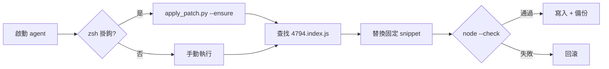

<p align="center">
  <a href="README.md">English</a> ·
  <a href="README.ko.md">한국어</a> ·
  <a href="README.ja.md">日本語</a> ·
  <a href="README.zh-CN.md">简体中文</a> ·
  <a href="README.zh-TW.md"><strong>繁體中文</strong></a>
</p>

<p align="center">
  
</p>

<h1 align="center">cursor-agent-cjk-input-patch</h1>

<p align="center">
  <strong>Cursor Agent CLI CJK 輸入修補</strong><br>
  <sub>Option/Ctrl 依詞移動 · 空行導覽 · 本機 · 可還原 · 非官方</sub>
</p>

<p align="center">
  <a href="LICENSE"></a>
  
  
  
</p>

<br>

<table>
<tr>
<td width="50%" valign="top">

### 修補前

在 `agent` 中輸入 **한글 · 日本語 · 中文** 時:

- **Option/Alt + ← / →** 跳過 CJK，跳到上一個 ASCII 詞
- 在換行 URL 上方 **空行按 ↑** 會捲動跳動，游標跳到 URL 行

</td>
<td width="50%" valign="top">

### 修補後

相同按鍵，自然行為:

- 依詞移動在 CJK 詞處停下 (`Intl.Segmenter`)
- 空行對應到正確的視覺行 — 無捲動跳動

</td>
</tr>
</table>

<p align="center">
  
</p>

<br>

## 快速開始

```bash
git clone https://github.com/vzts/cursor-agent-cjk-input-patch.git
cd cursor-agent-cjk-input-patch

python3 tests/test_behavior.py   # 驗證 — 無需安裝 Cursor
python3 apply_patch.py           # 修補最新 CLI + IDE worker
python3 apply_patch.py --install # 選用：每次 `agent` 啟動自動修補
```

修補後重新啟動 `agent` / `cursor-agent` 工作階段。

<details>
<summary><strong>環境需求</strong></summary>

<br>

- **Python 3** — 執行修補程式
- **Node.js** — 寫入前 `node --check`
- **macOS** — 路徑符合 Cursor Agent CLI
- **Cursor Agent CLI** — 需本機已安裝（本 repo 不含二進位檔）

</details>

<br>

## 修補內容

僅修改已安裝副本中的 **`4794.index.js`**（文字輸入套件）。

| | |
|:--|:--|
| **依詞移動** | ASCII helper → `Intl.Segmenter` (`granularity: "word"`), Option/Ctrl + 方向鍵 |
| **空行** | 修正 `findLine` — 空行與換行 EOL 不再落到 line 0 |

自動目標:

```
~/.local/share/cursor-agent/versions/<最新>/
~/Library/Application Support/Cursor/.../cursor-agent-worker/.../versions/<最新>/
```

<br>

## 故意不修補的部分

| 範圍 | 原因 |
|:-----|:-----|
| 一般 **← / →** | NFC 韓文已是 UTF-16 一音節步進 |
| **Backspace / Delete** grapheme | 同上 — 無需修補 |
| CJK **顯示寬度 ↑ / ↓** | 終端機游標每碼點 1 欄，寬度 2 計算錯誤 |
| **IME** 候選窗 | 舊重定位導致 `agent` 停住 — 已移除並拒絕 |

不使用跳脫序列移動終端機游標。

<br>

## 命令

```bash
python3 apply_patch.py              # 修補
python3 apply_patch.py --install    # zsh 掛鉤 → 啟動時自動修補
python3 apply_patch.py --ensure     # 已完成則靜默；不匹配則警告
python3 apply_patch.py --restore    # 從 .orig.bak 還原
python3 apply_patch.py --list-backups
python3 apply_patch.py --dry-run -v
python3 apply_patch.py --no-worker  # 僅 CLI
```

<details>
<summary><strong>CLI 更新 · 備份 · 重裝</strong></summary>

<br>

更新會替換版本目錄。重新執行 `python3 apply_patch.py`（若已 `--install`，直接啟動 `agent` 即可）。

備份 — 每個版本一份原典，不覆寫:

```
~/.local/share/cursor-agent-cjk-input-patch/backups/*.orig.bak
```

壓縮模式不匹配時 **不猜測**（`--ensure` 警告後仍啟動 `agent`）。最後手段:

```bash
curl https://cursor.com/install -fsS | bash
```

</details>

<br>

## 工作流程



模式固定於特定 minify 形狀 — Cursor 重新 minify 時不猜測。

<br>

## 測試

```bash
python3 tests/test_behavior.py
python3 tests/test_pty_arrows.py
```

<br>

<p align="center">
  <sub>非官方社群工具 · 與 Cursor 無關 · <a href="LICENSE">MIT</a> © 2026 <a href="https://github.com/vzts">vzts</a></sub>
</p>
